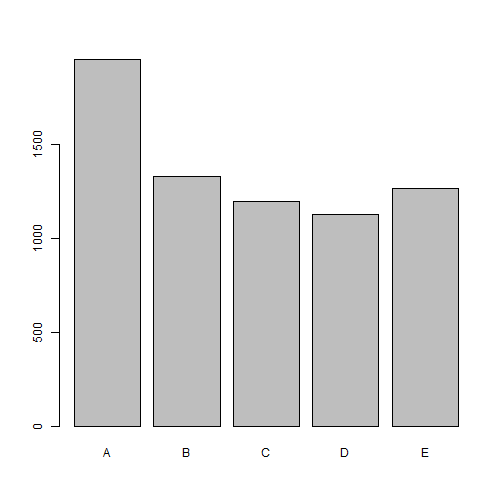

Machine learning algorithm 
========================================================

### Getting the data and cleaning it:
Since the dataset is huge, we will first start by removing the NAs.
Once we do so

```r
library(caret)
```

```
## Loading required package: lattice
## Loading required package: ggplot2
```

```r
rawdata <- read.csv("pml-training.csv", na.strings = c("NA", ""))  ## reading data from csv file
## Removing NAs
NAs <- apply(rawdata, 2, function(x) {
    sum(is.na(x))
})
data <- rawdata[, which(NAs == 0)]
inTrain <- createDataPartition(y = data$classe, p = 0.35, list = FALSE)  ## try 0.25 next time
training <- data[inTrain, ]
testing <- data[-inTrain, ]
dim(training)
```

```
## [1] 6869   60
```

```r
# discards unuseful predictors
removeIndex <- grep("timestamp|X|user_name|new_window", names(training))
training <- training[, -removeIndex]
```

### Exporing the data 

```r
plot(training$classe)
```

 

It's clear from the histogram that it's 5 factors variable. 

### Building the Machine learning algorithm
We will go with the rain forest algorithm, and we will change the train control from bootstrapping to cv,
as that will save computing time.


```r
# using the trainControl
fitControl <- trainControl(method = "cv", number = 4)

## try as a factor
modFit <- train(classe ~ ., data = training, method = "rf", trControl = fitControl, 
    prox = TRUE)
modFit$finalModel
```

```
## 
## Call:
##  randomForest(x = x, y = y, mtry = param$mtry, proximity = TRUE) 
##                Type of random forest: classification
##                      Number of trees: 500
## No. of variables tried at each split: 27
## 
##         OOB estimate of  error rate: 0.7%
## Confusion matrix:
##      A    B    C    D    E class.error
## A 1952    0    0    0    1    0.000512
## B   10 1311    7    1    0    0.013544
## C    0    7 1190    1    0    0.006678
## D    0    1    9 1115    1    0.009769
## E    0    3    0    7 1253    0.007918
```


### Sample error to be and estimate the error appropriately with cross-validation [The validation]
After creating the model for prediction, we want to test it with our validation dataset kept aside from the beginning when we sliced our training data.

```r
## PREDICTIONS
predictions <- predict(modFit, testing)
## CHECKING RESULTS
confusionMatrix(predictions, testing$classe)
```

```
## Confusion Matrix and Statistics
## 
##           Reference
## Prediction    A    B    C    D    E
##          A 3626   22    0    0    0
##          B    1 2428   15    0   10
##          C    0    9 2206   10    5
##          D    0    9    3 2079    7
##          E    0    0    0    1 2322
## 
## Overall Statistics
##                                         
##                Accuracy : 0.993         
##                  95% CI : (0.991, 0.994)
##     No Information Rate : 0.284         
##     P-Value [Acc > NIR] : <2e-16        
##                                         
##                   Kappa : 0.991         
##  Mcnemar's Test P-Value : NA            
## 
## Statistics by Class:
## 
##                      Class: A Class: B Class: C Class: D Class: E
## Sensitivity             1.000    0.984    0.992    0.995    0.991
## Specificity             0.998    0.997    0.998    0.998    1.000
## Pos Pred Value          0.994    0.989    0.989    0.991    1.000
## Neg Pred Value          1.000    0.996    0.998    0.999    0.998
## Prevalence              0.284    0.194    0.174    0.164    0.184
## Detection Rate          0.284    0.190    0.173    0.163    0.182
## Detection Prevalence    0.286    0.192    0.175    0.165    0.182
## Balanced Accuracy       0.999    0.991    0.995    0.996    0.995
```

We have a 99.3% of accuracy from this model after passing it through the validation and we can see all our results from the confussion matrix

### The test data set
Then we want to test our testing dataset, provided by the instructor, we will do the same thing and then go to the submission tab


```r
b <- read.csv("pml-testing.csv", na.strings = c("NA", ""))
NAsb <- apply(b, 2, function(x) {
    sum(is.na(x))
})
ba <- b[, which(NAsb == 0)]
removeIndexb <- grep("timestamp|X|user_name|new_window", names(ba))
bas <- ba[, -removeIndexb]
answers <- predict(modFit, bas)
answers <- as.character(answers)
```

